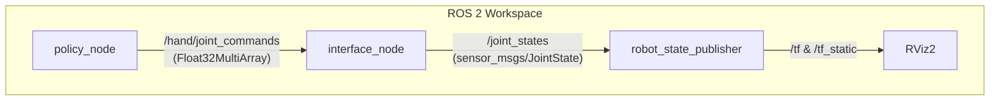

# Policy Deployment via ROS 2

This repository contains the ROS 2 (Humble) integration pipeline for deploying a trained PPO policy for dexterous grasping with the LEAP Hand. It loads the trained Stable Baselines 3 model, streams continuous joint commands through a kinematic interpolator, and visualizes the resulting motion in RViz2.

> **Deployment caveat:** The pipeline demonstrates ROS integration correctness, not policy performance fidelity. The trained policy expects real joint velocities (`obs[16:32]`) and a live object pose (`obs[32:39]`) at every timestep; this ROS pipeline cannot supply either. Both slices are zeroed or hardcoded, which constitutes a distribution shift from the training observation. The RViz "PPO Inference" mode shows the policy running on corrupted observations — see `Report_task_B.md` §2.1 and §5 for full analysis.

## 🚀 Architecture

The system utilizes a modular node-based architecture, keeping inference decoupled from kinematics and visualization.



### Nodes

1. **`policy_node`**: Loads the trained SB3 PPO model (or a sine-wave fallback). Runs inference at 10 Hz and publishes raw `[-1, 1]` delta-position targets to `/hand/joint_commands`. In inference mode, joint positions are read back from `/joint_states`; velocities and object pose cannot be recovered from this pipeline and are zeroed/hardcoded.
2. **`interface_node`**: Kinematic bridge. Interprets each action as a delta on the current target position (scaled by `max_delta = 0.05 rad`), clips to per-joint physical limits, and publishes smooth `sensor_msgs/JointState` at 100 Hz via an exponential moving average (α = 0.15, τ ≈ 61.5 ms).
3. **`robot_state_publisher`**: Parses `leap_hand.urdf` to broadcast the full TF tree and link meshes to RViz2.

## ⚙️ Building the Workspace

1. Source your ROS 2 Humble installation:
   ```bash
   source /opt/ros/humble/setup.bash
   ```
2. Navigate to the `ros2_ws` directory and build:
   ```bash
   cd Policy_Deployment_via_ROS2/ros2_ws
   colcon build --symlink-install
   ```
3. Source the local setup:
   ```bash
   source install/setup.bash
   ```

## 🎥 Running the Pipeline

A single launch file orchestrates the entire deployment:

```bash
ros2 launch leap_deployment display.launch.py
```

This launches `policy_node`, `interface_node`, `robot_state_publisher`, and RViz2 with a pre-configured perspective.

**To force sine-wave mode** (demonstrates the full pipeline without requiring the trained model):

```bash
ros2 launch leap_deployment display.launch.py use_sine_wave:=true
```

## 🔧 Fallback Behaviour

If `best_model.zip` cannot be located or fails to load, `policy_node` automatically falls back to a programmatic sine-wave trajectory. This allows the complete ROS pipeline — node graph, TF broadcast, kinematic smoothing, RViz rendering — to be verified independently of the trained model.
