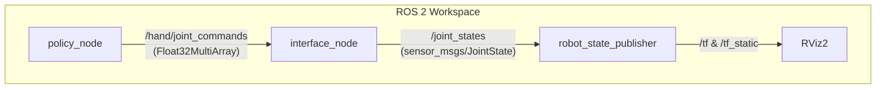

# Policy Deployment via ROS 2

This repository contains the ROS 2 integration pipeline for deploying a trained reinforcement learning policy (PPO) for dexterous grasping with the LEAP Hand. 

The primary objective of this task is to demonstrate the deployment of a simulated RL policy into a standard ROS 2 architecture, streaming continuous joint commands to a visualizer (RViz2) and simulating rudimentary contact physics for grasping.

## 🚀 Architecture

The system utilizes a modular node-based architecture, keeping inference decoupled from kinematics and visualization.



### Nodes

1. **`policy_node`**: Loads the trained Stable Baselines 3 PPO model (or a fallback sine wave if the model is unavailable/fails to load). It evaluates the continuous action space at 10 Hz and publishes targets to `/hand/joint_commands`.
2. **`interface_node`**: Acts as a bridge and kinematic interpolator. It ingests delta-position commands, clips them to physical joint limits, applies an exponential moving average (100 Hz) for smooth trajectories, and publishes standard `sensor_msgs/JointState`.
3. **`robot_state_publisher`**: Parses `leap_hand.urdf` to broadcast static transforms and link meshes.

## ⚙️ Building the Workspace

1. Source your ROS 2 Humble installation:
   ```bash
   source /opt/ros/humble/setup.bash
   ```
2. Navigate to the `ros2_ws` directory and build:
   ```bash
   cd Policy_Deployment_via_ROS2/ros2_ws
   colcon build --symlink-install
   ```
3. Source the local setup:
   ```bash
   source install/setup.bash
   ```

## 🎥 Running the Pipeline

A single launch file orchestrates the entire deployment:

```bash
ros2 launch leap_deployment display.launch.py
```

This will automatically launch the nodes along with a pre-configured RViz instance. You will see the LEAP Hand continuously execute its policy (or sine wave).

## 🔧 Fallback Note
If the SB3 PPO model cannot be located locally, the `policy_node` gracefully degrades to generating a programmatic sine-wave trajectory that opens and closes all fingers. This serves to robustly demonstrate the ROS 2 integration pipeline irrespective of RL convergence.
